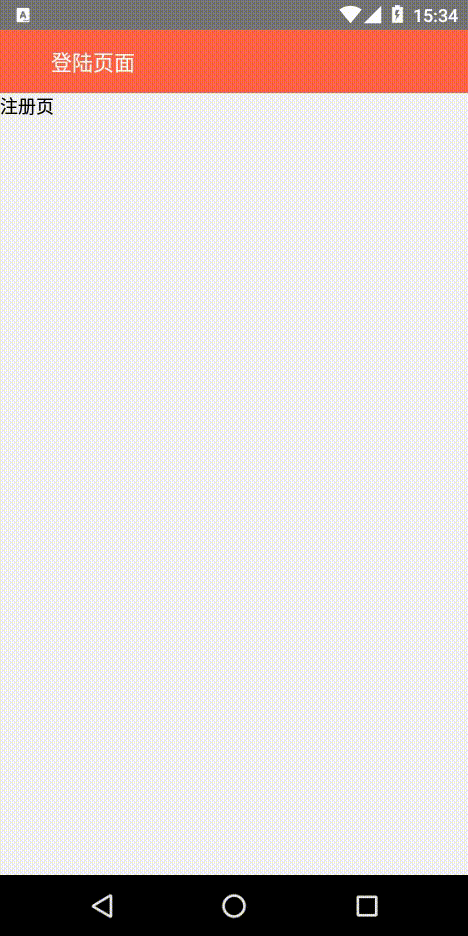

# React-Native配置@react-navigation/stack@6.x——使用自定义导航栏

### 先放一张效果图

<div style=" text-align: left;"></div>

## 相关依赖版本

```
> "@react-native-masked-view/masked-view": "^0.2.6",
> "@react-navigation/native": "^6.0.2",
> "@react-navigation/stack": "^6.0.7",
> "react": "17.0.2",
> "react-native": "0.65.1",
> "react-native-gesture-handler": "^1.10.3",
> "react-native-safe-area-context": "^3.3.2",
> "react-native-screens": "^3.7.2",
```

# 安装准备

## 1. 安装`react-navigation`

```shell
npm install @react-navigation/native react-native-screens react-native-safe-area-context @react-navigation/stack react-native-gesture-handler @react-native-masked-view/masked-view
```

在`App.js`顶部第一行引入

```js
import 'react-native-gesture-handler';
```

## 2. 安卓配置

在`MainActivity.java`中添加如下代码

```java
import android.os.Bundle; // 顶部添加

@Override
protected void onCreate(Bundle savedInstanceState) {
  super.onCreate(null);
}
```

# 配置使用

为了使整个应用都使用统一的页面切换风格，以及便于管理页面路由，我封装了一个路由模块组件，只需要传入页面列表。

## 1. 路由模块

### `navigatorConfig.js`代码

```react
import React from "react";
import { TransitionPresets } from "@react-navigation/stack";

const getCurrentScreenIndex = ({navigation, route}) => {
  return navigation.getState().routes.findIndex(item => {
    return item.key === route.key;
  });
}

export const NavigatorConfig = {
  StackNavigatorDefaultConfig: {
    screenOptions: ({navigation, route}) => {
      const screenIndex = getCurrentScreenIndex({navigation, route})
      const screenCount = navigation.getState().index;
      // false不从内存中释放页面
      // 配置为堆栈最顶部的两个页面不释放
      const detachPreviousScreen = screenCount - screenIndex > 1;
      return {
        headerShown: false, // 关闭默认导航
        gestureEnabled: true, // 手势可操作
        ...TransitionPresets.SlideFromRightIOS, // 这里使用的是传统的右边滑入
        detachPreviousScreen,
      }
    }
  },
}

```

### `routerModule.js`部分代码

```react
import { NavigationContainer } from "@react-navigation/native";
import { createStackNavigator } from "@react-navigation/stack";
const Stack = createStackNavigator();
import { NavigatorConfig } from "./navigatorConfig"; // 每个页面通用的配置

<NavigationContainer ref={this.props.navRef}>
  <Stack.Navigator {...NavigatorConfig.StackNavigatorDefaultConfig} {...this.props.config}>
    {
      this.props.page && this.props.page.map((item, index) => {
        item.options = item.options || {};
        item.params = item.params || {};
        const Component = item.view;
        return (
          <Stack.Screen key={item.name}
                        name={item.name}
                        options={item.options}
                        {...item.config}
          >
            {
              props => <Component {...props} {...item.params} title={item.title || undefined}/>
            }
          </Stack.Screen>
        )
      })
    }
  </Stack.Navigator>
</NavigationContainer>
```


### 使用路由模块代码示例(App.js)

```react
const IndexRouterConfig = [
    {
        name: 'LoginForm', // 必填，页面名称，用于跳转
        view: LoginForm, // 必填，继承于NavPage的页面组件
        title: '', // 选填，页面的导航标题       
        params: {}, // 选填，给页面组件的props    
        options: {}, // 选填，<Stack.Screen>的options，可配置页面动画效果
        config: {}, // 选填，<Stack.Screen>的整体props，会覆盖上面的取值
    }
]

<RouterModule 
	page={IndexRouterConfig} 
	config={{
      // 可使用这个config覆盖默认的页面配置即NavigatorConfig
      initialRouteName: 'LoginForm'                             
    }}
    navRef={navigationRef} // 第二点讲到
/>
```


## 2. 使用导航

1. 封装`navigationRef`使得所有页面都可以通过`context`使用导航方法

    ```react
    import { createNavigationContainerRef, StackActions, CommonActions } from '@react-navigation/native';
    export const navigationRef = createNavigationContainerRef();
    
    navigationRef.push = (...args) => {
      if (navigationRef.isReady()) {
        navigationRef.dispatch(StackActions.push(...args));
      } else {
        alert('页面还没准备好');
      }
    }
    
    navigationRef.goBack = (...args) => {
      setTimeout(() => {
        navigationRef.dispatch(CommonActions.goBack(...args));
      }, 0)
    }
    
    ```

2. 在`App.js`中使用`context`传播到各个页面和组件中(可用新的context方法)

   ```react
   import { navigationRef} from "./navigation/navigationRef";
   
   static childContextTypes = {
       navigation: PropTypes.object
   };
   getChildContext() {
       return {
           navigation: navigationRef
       };
   }


## 3. 页面组件

封装了一个页面组件`NavPage`，所有的需要导航的页面都需要继承自这个组件，只能在`renderPage`中渲染页面内容。

```react
// NavPage.js
import React from "react";
import { TouchableOpacity, View, Text } from "react-native";
import PropTypes from "prop-types";

class NavPage extends React.Component {
  static defaultProps = {
    showBackButton: true
  }

  static contextTypes = {
    navigation: PropTypes.object,
  };

  renderNavigationTitle() {
    return this.props.title || '';
  }

  renderNavigationBar() {
    return (
      <View style={{
        height: 50,
        paddingHorizontal: 10,
        backgroundColor: 'tomato',
        alignItems: 'center',
        flexDirection: "row",
        justifyContent: 'flex-start'
      }}>
        {
          (this.context.navigation && this.context.navigation.isReady() && this.context.navigation.canGoBack()) &&
          !!this.props.showBackButton && <TouchableOpacity onPress={() => {
            this.context.navigation.goBack()
          }}>
            <Text style={{color: 'white', fontSize: 12}}>返回</Text>
          </TouchableOpacity>
        }
        <Text style={{color: 'white', fontSize: 16, marginLeft: 30}}>
          {this.renderNavigationTitle()}
        </Text>
      </View>
    );
  }

  renderPage() {
    return null;
  }

  render() {
    return (
      <View style={{flex: 1}}>
        {this.renderNavigationBar()}
        {this.renderPage()}
      </View>
    )
  }
}

export default NavPage;

```


# 业务页面使用

### `LoginForm.js`

```react
import React from "react";
import { Text, TouchableOpacity, View } from "react-native";
import NavPage from "../navigation/navPage";

class LoginForm extends NavPage {
  static defaultProps = {
    ...NavPage.defaultProps,
    title: '登陆页面',
  };

  renderPage() {
    return (
      <View>
        <TouchableOpacity
          onPress={() => {
            this.context.navigation.push('Register')
          }}
        >
          <Text>注册页</Text>
        </TouchableOpacity>
      </View>
    )
  }
}

export default LoginForm;
```
